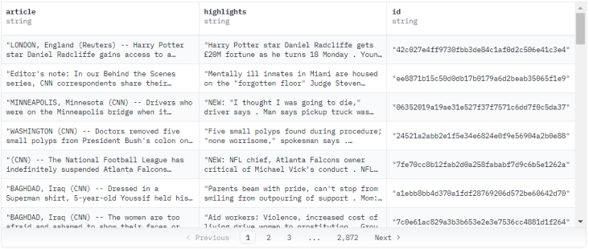
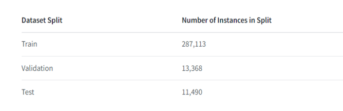
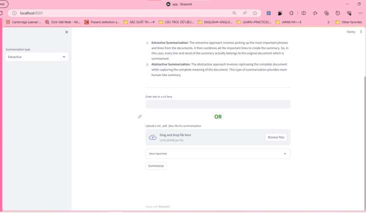
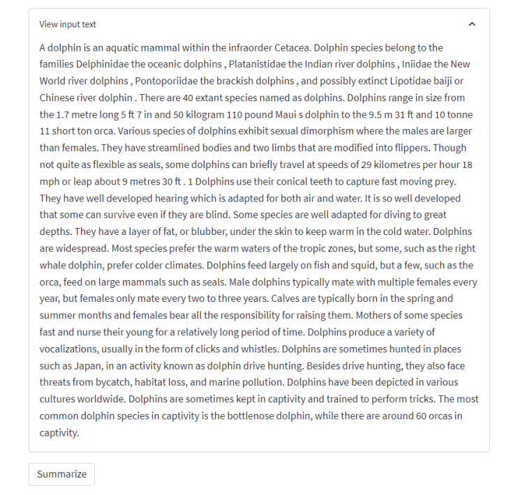
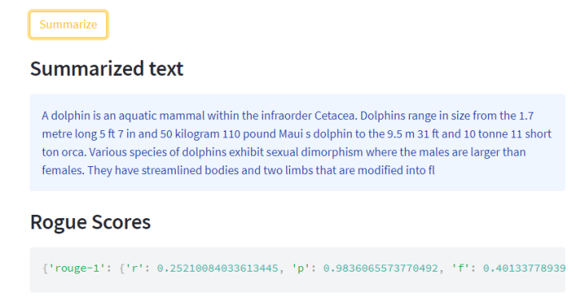

# Text Summarizer
### Text summarizer using BART model

Đây là bài tập lớn môn xử lý ngôn ngữ tự nhiên với đề tài xây dựng một hệ thống tóm tắt đa văn bản, với mô hình kiến trúc BART được sử dụng làm công cụ chính.

## Tổng quan về Text summarization
**Text summarization** (tóm tắt văn bản) là quá trình rút trích các thông tin quan trọng nhất từ một văn bản để tạo ra một phiên bản ngắn gọn, súc tích nhưng vẫn bảo toàn được nội dung chính của văn bản gốc. Bản tóm tắt phải giữ được những thông tin quan trọng của toàn bộ văn bản chính.

Có hai phương pháp chính để tóm tắt văn bản: trích xuất và trừu tượng.

- **Phương pháp trích xuất (extractive summarization)** là phương pháp tìm và lấy ra các câu hoặc đoạn văn quan trọng nhất từ văn bản gốc để tạo thành bản tóm tắt.
  
- **Phương pháp trừu tượng (abstractive summarization)** là phương pháp tạo ra một bản tóm tắt mới bằng cách tóm tắt lại nội dung của văn bản gốc bằng cách sử dụng các từ, cụm từ và câu mới.

## Data
Sử dụng bộ dữ liệu CNN/DailyMail (https://github.com/huggingface/datasets/blob/master/datasets/cnn_dailymail/cnn_dailymail.py) là một bộ dữ liệu tiếng Anh gồm hơn 300.000 bài báo tin tức độc nhất được viết bởi các nhà báo của CNN và Daily Mail. Phiên bản hiện tại hỗ trợ cả tóm tắt trích xuất (extractive) và tóm tắt tóm lược (abstractive).

- Trong đó số lượng từ trung bình của bài báo gốc (article) là 781 từ, trong khi phần tóm tắt (highlights) có 56 từ trung bình. Điều này cho thấy phần tóm tắt thực sự ngắn hơn bài báo gốc rất nhiều.
- Các trường dữ liệu bao gồm id, bài báo gốc (article) và phần tóm tắt (highlights). Trong đó tóm tắt là phần quan trọng nhất.
- Dữ liệu được chia thành 3 tập: train, validation và test. Tập train chiếm phần lớn với 287,113 mẫu.

## Demo
**Xây dựng trang web dùng streamlit**

Kiểm thử 
Văn bản 1: dolphin wiki

Kết quả tóm tắt: 

